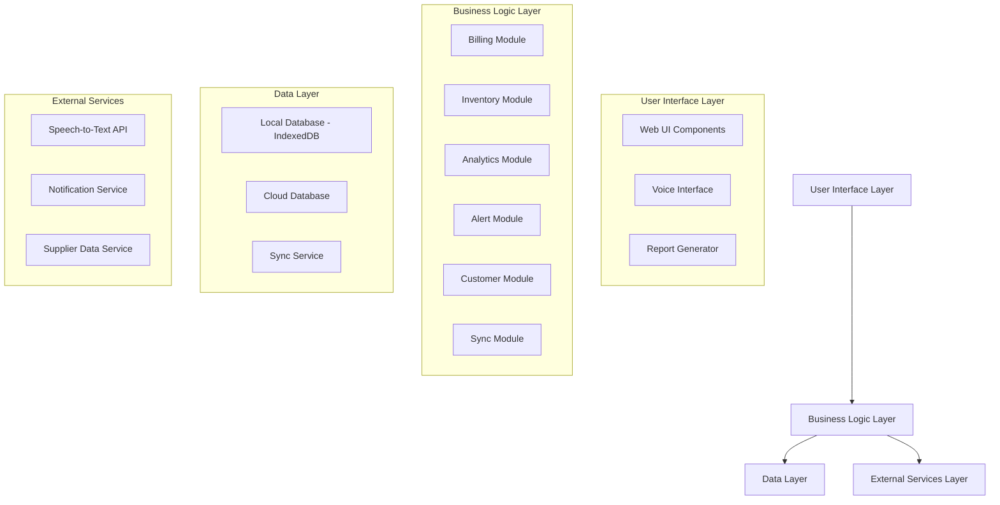

# Design Document: Smart Stock Management Application

## Overview

The Smart Stock Management Application is an offline-first, web-based inventory management system designed for brick-and-mortar retailers. The system employs a modular architecture with local-first data management, enabling continuous operation during network outages while providing sophisticated demand forecasting and business analytics capabilities.

The design prioritizes user experience through a simple, intuitive interface while delivering enterprise-grade functionality including real-time inventory tracking, intelligent demand forecasting using time-series analysis, and comprehensive business analytics.

## Architecture

The system follows a layered, offline-first architecture pattern with the following key principles:

- **Local-First Data Management**: All essential data is stored locally using IndexedDB, with the server acting as a synchronization point
- **Progressive Enhancement**: Core functionality works offline, with additional features enabled when connectivity is available
- **Event-Driven Architecture**: Components communicate through events to maintain loose coupling
- **Modular Design**: Each business domain is encapsulated in separate modules with well-defined interfaces

### High-Level Architecture



## Components and Interfaces

### User Interface Layer

**Web UI Components**
- **Billing Interface**: Handles transaction processing with support for manual entry, barcode scanning, and voice input
- **Inventory Dashboard**: Displays current stock levels, alerts, and inventory movements
- **Analytics Dashboard**: Presents demand forecasts, profit/loss reports, and business insights
- **Customer Management Interface**: Manages customer profiles, purchase history, and loyalty programs
- **Settings Panel**: Configures system preferences, alert thresholds, and language settings

**Voice Interface**
- Integrates with Speech-to-Text API for hands-free billing operations
- Supports multi-language voice commands
- Provides audio feedback for command confirmation

**Report Generator**
- Creates visual reports with charts and graphs
- Supports multiple export formats (PDF, Excel, CSV)
- Enables scheduled report generation

### Business Logic Layer

**Billing Module**
```typescript
interface BillingModule {
  createBill(items: BillItem[]): Promise<Bill>
  processBill(bill: Bill): Promise<BillResult>
  correctBill(billId: string, corrections: BillCorrection[]): Promise<Bill>
  addItemToBill(billId: string, item: BillItem): Promise<void>
  calculateTotal(bill: Bill): Money
}
```

**Inventory Module**
```typescript
interface InventoryModule {
  updateStock(productId: string, quantity: number, operation: StockOperation): Promise<void>
  getStockLevel(productId: string): Promise<number>
  checkLowStock(): Promise<Product[]>
  trackExpiry(productId: string, expiryDate: Date): Promise<void>
  getExpiringProducts(daysAhead: number): Promise<Product[]>
}
```

**Analytics Module**
```typescript
interface AnalyticsModule {
  generateDemandForecast(productId: string, timeHorizon: number): Promise<ForecastResult>
  analyzeSalesPatterns(timeRange: DateRange): Promise<SalesAnalysis>
  calculateProfitLoss(timeRange: DateRange): Promise<ProfitLossReport>
  identifyProductMovement(): Promise<ProductMovementAnalysis>
  detectSeasonality(productId: string): Promise<SeasonalityPattern>
}
```

**Alert Module**
```typescript
interface AlertModule {
  checkStockLevels(): Promise<StockAlert[]>
  checkExpiryDates(): Promise<ExpiryAlert[]>
  sendAlert(alert: Alert, channels: NotificationChannel[]): Promise<void>
  configureAlertThresholds(productId: string, thresholds: AlertThresholds): Promise<void>
}
```

**Customer Module**
```typescript
interface CustomerModule {
  createCustomer(customerData: CustomerData): Promise<Customer>
  updatePurchaseHistory(customerId: string, purchase: Purchase): Promise<void>
  calculateLoyaltyScore(customerId: string): Promise<number>
  applyRewards(customerId: string, billId: string): Promise<Discount[]>
  getCustomerAnalytics(customerId: string): Promise<CustomerAnalytics>
}
```

**Sync Module**
```typescript
interface SyncModule {
  syncToCloud(): Promise<SyncResult>
  syncFromCloud(): Promise<SyncResult>
  resolveConflicts(conflicts: DataConflict[]): Promise<ConflictResolution[]>
  getOfflineStatus(): boolean
  queueForSync(operation: DataOperation): Promise<void>
}
```

## Data Models

### Core Entities

**Product**
```typescript
interface Product {
  id: string
  name: string
  category: string
  barcode?: string
  costPrice: Money
  sellingPrice: Money
  currentStock: number
  minStockLevel: number
  maxStockLevel: number
  unit: string
  expiryDate?: Date
  supplierId: string
  createdAt: Date
  updatedAt: Date
}
```

**Bill**
```typescript
interface Bill {
  id: string
  customerId?: string
  items: BillItem[]
  subtotal: Money
  tax: Money
  discount: Money
  total: Money
  paymentMethod: PaymentMethod
  status: BillStatus
  createdAt: Date
  processedAt?: Date
}

interface BillItem {
  productId: string
  quantity: number
  unitPrice: Money
  totalPrice: Money
}
```

**Customer**
```typescript
interface Customer {
  id: string
  name: string
  phone?: string
  email?: string
  address?: Address
  loyaltyScore: number
  totalPurchases: Money
  lastPurchaseDate?: Date
  preferredLanguage: string
  createdAt: Date
}
```

**Forecast**
```typescript
interface ForecastResult {
  productId: string
  forecastPeriod: DateRange
  predictedDemand: number[]
  confidenceInterval: {
    lower: number[]
    upper: number[]
  }
  seasonalityFactor: number
  trendFactor: number
  accuracy: number
  generatedAt: Date
}
```

**Alert**
```typescript
interface Alert {
  id: string
  type: AlertType
  severity: AlertSeverity
  productId?: string
  message: string
  actionRequired: boolean
  createdAt: Date
  acknowledgedAt?: Date
}
```

### Data Storage Strategy

**Local Storage (IndexedDB)**
- Primary data store for offline operation
- Stores all transactional data, inventory levels, and customer information
- Implements automatic data compression for large datasets
- Maintains data integrity through transaction logs

**Cloud Database**
- Centralized data repository for multi-device synchronization
- Stores aggregated analytics and historical data
- Implements backup and disaster recovery
- Supports real-time data replication

**Synchronization Strategy**
- **Delta Synchronization**: Only changed data is synchronized to optimize network usage
- **Conflict Resolution**: Last-write-wins with manual resolution for critical conflicts
- **Offline Queue**: Operations are queued during offline periods and processed when connectivity returns
- **Data Versioning**: Each record maintains version numbers for conflict detection

## Demand Forecasting Algorithm

The system implements a hybrid forecasting approach combining multiple time-series analysis techniques:

### Time Series Decomposition
1. **Trend Analysis**: Identifies long-term growth or decline patterns using linear regression
2. **Seasonality Detection**: Uses Fourier analysis to detect recurring patterns (daily, weekly, monthly, yearly)
3. **Cyclical Pattern Recognition**: Identifies irregular cycles related to business events or market conditions

### Forecasting Models
1. **Exponential Smoothing**: For short-term forecasts with adaptive learning
2. **ARIMA (AutoRegressive Integrated Moving Average)**: For medium-term forecasts with trend and seasonality
3. **Seasonal Decomposition of Time Series (STL)**: For handling complex seasonal patterns

### External Factor Integration
- **Event Calendar**: Incorporates festivals, holidays, and local events
- **Weather Data**: Considers weather impact on product demand
- **Market Trends**: Integrates broader market indicators when available

### Forecast Accuracy Measurement
- **Mean Absolute Percentage Error (MAPE)**: Primary accuracy metric
- **Root Mean Square Error (RMSE)**: For measuring forecast precision
- **Tracking Signal**: For detecting forecast bias

## Error Handling

### Offline Operation Errors
- **Data Corruption**: Automatic data validation and repair mechanisms
- **Storage Limits**: Intelligent data archiving and cleanup procedures
- **Sync Failures**: Exponential backoff retry strategy with manual intervention options

### Business Logic Errors
- **Inventory Discrepancies**: Automatic reconciliation with audit trail
- **Billing Errors**: Transaction rollback capabilities with correction workflows
- **Forecast Failures**: Fallback to simpler forecasting methods with accuracy warnings

### User Interface Errors
- **Input Validation**: Real-time validation with helpful error messages
- **Network Timeouts**: Graceful degradation to offline mode
- **Voice Recognition Errors**: Confirmation dialogs for voice commands

### Data Integrity
- **Transaction Atomicity**: All database operations are wrapped in transactions
- **Referential Integrity**: Foreign key constraints maintained in local database
- **Data Validation**: Schema validation for all data operations
- **Audit Logging**: Complete audit trail for all data modifications

## Testing Strategy

The testing approach combines unit testing for specific functionality with property-based testing for universal correctness properties.

### Unit Testing
- **Component Testing**: Individual module testing with mocked dependencies
- **Integration Testing**: End-to-end workflow testing
- **UI Testing**: User interface interaction testing
- **API Testing**: External service integration testing

### Property-Based Testing
Property-based tests will validate universal properties across all inputs using a minimum of 100 iterations per test. Each test will be tagged with the format: **Feature: smart-stock-management, Property {number}: {property_text}**

The system will use a property-based testing library appropriate for the chosen implementation language to ensure comprehensive input coverage and catch edge cases that traditional unit tests might miss.

### Performance Testing
- **Load Testing**: System performance under high transaction volumes
- **Stress Testing**: System behavior at capacity limits
- **Offline Performance**: Response times during offline operation
- **Sync Performance**: Data synchronization efficiency testing

### Security Testing
- **Data Encryption**: Verification of data encryption at rest and in transit
- **Access Control**: Authentication and authorization testing
- **Input Sanitization**: Protection against injection attacks
- **Audit Trail**: Verification of complete audit logging

## Correctness Properties

*A property is a characteristic or behavior that should hold true across all valid executions of a system—essentially, a formal statement about what the system should do. Properties serve as the bridge between human-readable specifications and machine-verifiable correctness guarantees.*

Based on the prework analysis and property reflection to eliminate redundancy, the following properties validate the core correctness requirements of the Smart Stock Management Application:

### Property 1: Inventory Update Consistency
*For any* bill processing or inventory correction operation, the inventory quantities should be updated accurately and immediately reflect the changes in all related system components.
**Validates: Requirements 1.2, 3.2**

### Property 2: Transaction Data Persistence
*For any* transaction or customer interaction, all required data fields should be stored completely and remain accessible for future retrieval and analysis.
**Validates: Requirements 1.3, 4.2, 15.1, 15.3**

### Property 3: Receipt Generation Completeness
*For any* completed bill, the generated receipt should contain all transaction details including items, quantities, prices, totals, and customer information.
**Validates: Requirements 1.5**

### Property 4: Voice Command Processing
*For any* valid voice command processed by the system, the corresponding items should be correctly added to the current bill with accurate product and quantity information.
**Validates: Requirements 2.3**

### Property 5: Transaction Modification Capability
*For any* completed transaction within the allowed time window, the system should permit modifications while maintaining data integrity and audit trail completeness.
**Validates: Requirements 3.1, 3.3**

### Property 6: Authorization Time Limits
*For any* correction attempt beyond the specified time limit, the system should require proper authorization before allowing the modification.
**Validates: Requirements 3.4**

### Property 7: Analytics Recalculation Trigger
*For any* inventory correction that affects historical data, the system should automatically recalculate all related analytics and forecasts to maintain accuracy.
**Validates: Requirements 3.5**

### Property 8: Offline Operation Continuity
*For any* system operation during offline mode, full billing and inventory functionality should remain available using local storage without data loss.
**Validates: Requirements 4.1, 4.3**

### Property 9: Offline Data Queuing
*For any* data change made during offline operation, the change should be queued for synchronization and successfully processed when connectivity returns.
**Validates: Requirements 4.5**

### Property 10: Automatic Synchronization
*For any* connectivity restoration event, the sync service should automatically synchronize all queued local data with cloud storage while handling conflicts appropriately.
**Validates: Requirements 5.1, 5.2, 5.3**

### Property 11: Sync Completion Confirmation
*For any* successful synchronization operation, the system should provide confirmation and update the local data status accordingly.
**Validates: Requirements 5.4**

### Property 12: Sync Failure Recovery
*For any* synchronization failure, the system should implement exponential backoff retry logic and notify users of the failure status.
**Validates: Requirements 5.5**

### Property 13: Sales Pattern Analysis
*For any* historical sales data set, the analytics module should identify trends, seasonal variations, and event-based patterns with consistent methodology.
**Validates: Requirements 6.1, 6.2, 6.3, 6.5**

### Property 14: Sales Velocity Calculation
*For any* product category with sales history, the system should calculate accurate sales velocity metrics for inventory planning.
**Validates: Requirements 6.4**

### Property 15: Demand Forecast Generation
*For any* product with sufficient historical data, the system should generate demand forecasts incorporating seasonality, events, and confidence intervals.
**Validates: Requirements 7.1, 7.2, 7.3, 7.4, 7.5**

### Property 16: Stock Alert Generation
*For any* product with inventory levels at or below defined thresholds, the system should generate appropriate alerts and deliver them through configured notification channels.
**Validates: Requirements 8.2, 8.3, 8.5**

### Property 17: Reorder Recommendation Optimization
*For any* low-stock situation, the system should generate optimal reorder recommendations considering demand forecasts, lead times, storage constraints, and supplier requirements.
**Validates: Requirements 9.1, 9.2, 9.3, 9.4, 9.5**

### Property 18: Supplier Evaluation and Selection
*For any* reordering scenario with multiple suppliers, the system should compare and evaluate suppliers based on price, delivery time, and reliability to recommend the optimal choice.
**Validates: Requirements 10.2, 10.3, 10.4, 10.5**

### Property 19: Profit and Loss Calculation Accuracy
*For any* time period and product set, the system should calculate comprehensive profit and loss metrics including all relevant costs and identify the most and least profitable items.
**Validates: Requirements 11.1, 11.2, 11.3, 11.4, 11.5**

### Property 20: Product Movement Classification
*For any* product with sales history, the system should accurately classify movement patterns, calculate turnover rates, identify declining trends, and recommend appropriate actions.
**Validates: Requirements 12.1, 12.2, 12.3, 12.4, 12.5**

### Property 21: Comprehensive Report Generation
*For any* requested report parameters, the system should generate complete reports with accurate data, visual elements, and proper formatting for the specified products, categories, and time periods.
**Validates: Requirements 13.1, 13.2, 13.3**

### Property 22: Expiry Management System
*For any* perishable product, the system should track expiry dates, generate timely warnings, prioritize FIFO sales, automatically mark expired items as unsellable, and track associated waste costs.
**Validates: Requirements 14.1, 14.2, 14.3, 14.4, 14.5**

### Property 23: Customer Analytics and Insights
*For any* customer with purchase history, the system should track preferences, buying patterns, calculate loyalty scores, and provide comprehensive analytics including lifetime value and purchase frequency.
**Validates: Requirements 15.2, 15.4, 15.5, 16.1**

### Property 24: Loyalty Program Automation
*For any* customer transaction, the system should automatically apply applicable discounts based on loyalty qualifications and track program effectiveness.
**Validates: Requirements 16.2, 16.4, 16.5**

### Property 25: Multi-Language Interface Consistency
*For any* language selection, the system should display all interface elements in the chosen language and maintain language preferences for individual user accounts.
**Validates: Requirements 17.2, 17.5**